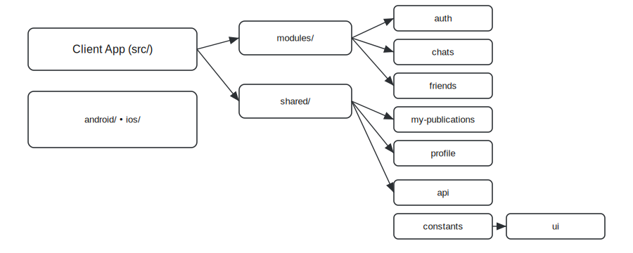

**Назва Проєкту**

# SocialNetowrk — Social Networking Frontend

**Прев'ю проекту**


**Для кого та навіщо**

Цей проєкт — фронтенд частина соціальної мережі, створений для демонстрації повнофункціонального клієнтського застосунку: пости, альбоми, приватні та групові чати, система друзів, налаштування профілю, реєстрація/авторизація, робота з файлами (зображення), та інтеграція з веб-сокетами для реального часу. Корисний для:
- Студентів та початківців, що вивчають React/React Native та роботу з WebSocket.
- Команд, які потребують шаблону для соціальної функціональності.
- Розробників, що створюють прототипи месенджерів або соціальних фіч.


<a id="content"></a>
**Зміст README.md**

1. [Назва проєкту](#project-name)
2. [Прев'ю](#preview)
3. [Мета та користувачі](#purpose)
4. [Зміст](#content)
5. [Діаграма-структура](#diagram-structure)
6. [Розгортання (Windows / Mac)](#deployment)
7. [Налаштування оточення (Node.js)](#environment)
8. [Запуск проєкту (Windows / Mac)](#running)
9. [Особливості розробки](#features)
10. [Висновок](#conclusion)


<a id="diagram-structure"></a>
**Діаграма-структура проєкту**

[](docs/diagrams/project_structure.svg)

🔙 Повернутись до змісту: [Зміст](#content)

**6. Розгортання проєкту на локальному ПК (завантаження з GitHub)**

Нижче — універсальні кроки для Windows та macOS.


- Крок 1: Відкрити термінал/PowerShell (Windows) або Terminal (macOS).
- Крок 2: Перейти в папку куди хочете клонувати:

Windows (PowerShell):
```powershell
cd C:\Projects
git clone https://github.com/DmytroChep/SocialNetworkFront
cd socialNetowrk
```

macOS / Linux:
```bash
cd ~/Projects
git clone https://github.com/DmytroChep/SocialNetworkFront
cd socialNetowrk
```

- Крок 3: Перевірити наявність `package.json` та `package-lock.json` або `yarn.lock`.
- Крок 4: Встановити залежності (npm або yarn):

Windows:
```powershell
npm install
# або: yarn install
```

macOS:
```bash
npm install
# або: yarn install
```

🔙 Повернутись до змісту: [Зміст](#content)

**7. Налаштування оточення (Node.js)**

Цей проєкт — фронтенд на Node.js / React Native, тому далі наведені кроки для налаштування Node.js середовища.

- Windows:
  1. Встановіть Node.js з офіційного сайту: https://nodejs.org (LTS).
  2. Перевірте версії:
  ```powershell
  node -v
  npm -v
  ```
  3. (Опціонально) Встановіть `nvm-windows` для керування версіями Node.

- macOS:
  1. Встановіть Node.js через Homebrew або офіційний інсталятор:
  ```bash
  brew install node
  node -v
  npm -v
  ```
  2. (Опціонально) Встановіть `nvm` і виберіть LTS версію:
  ```bash
  curl -o- https://raw.githubusercontent.com/nvm-sh/nvm/v0.39.4/install.sh | bash
  nvm install --lts
  ```

🔙 Повернутись до змісту: [Зміст](#content)

**8. Запуск проєкту (Windows / Mac)**

Ці інструкції стосуються React / Expo / React Native фронтенду.

- Windows / macOS — локальний запуск (development):
  1. Відкрити термінал у корені проекту `socialNetowrk`.
  2. Встановити залежності (як у розділі 6).
  3. Якщо це Expo-проєкт, запустіть:
  ```bash
  npx expo start
  # або
  npm run start
  ```
  4. Для веб-версії (якщо підтримується): натисніть `w` у Expo CLI або запустіть `npm run web`.
  5. Для запуску на емулаторі Android:
  - Запустіть Android Studio та емулятор, або підключіть фізичний пристрій з увімкненим USB debugging.
  - `npx react-native run-android` (якщо не Expo).
  6. Для iOS (macOS лише):
  - Відкрийте Xcode проект у `ios/` та запустіть, або `npx react-native run-ios`.

Після успішного запуску відкрийте застосунок на пристрої або в браузері за інструкцією CLI.

🔙 Повернутись до змісту: [Зміст](#content)

**9. Особливості розробки**

Нижче — детальний опис принципів роботи ключових функцій у цьому проєкті.

- Робота з зображеннями
  - Зображення користувачів та публікацій завантажуються через форми у фронтенді, кешуються у локальному сховищі (наприклад, AsyncStorage) для швидкого відтворення, і завантажуються на бекенд через multipart/form-data або через pre-signed URLs, якщо використовується S3.
  - При відображенні використовуються оптимізовані компоненти, що підвантажують зменшені прев'ю (thumbnails) і підвантажують повну картинку по потребі.
  - Для завантаження великих файлів передбачена індикація прогресу та обробка помилок мережі.
  - GIF-приклад роботи: [Завантаження зображення](docs/gifs/feature_upload.gif)
  🔙 Повернутись до змісту: [Зміст](#content)

- Робота з веб-сокетами
  - Двосторонній зв'язок організований через WebSocket (Socket.IO або native WebSocket). На фронтенді є SocketManager (див. socket_backend_patch/SocketManager.example.ts), який: створює підключення, реєструє обробники подій (message, user-typing, presence), та ретранслює події у React context для компонентів.
  - При підключенні користувач надсилає свій токен авторизації для валідації на сервері.
  - Реалізовано повторні підключення, backoff та повідомлення про статус з'єднання у UI.
  - GIF-приклад (чат): [Відправка повідомлення](docs/gifs/feature_chat.gif)
  🔙 Повернутись до змісту: [Зміст](#content)

- Принцип роботи постів, альбомів, налаштувань, чатів
  - Пости та альбоми:
    - Користувач створює пост з текстом та опційними зображеннями.
    - Пости зберігаються у бекенді, повертаються списком з пагінацією. На фронтенді реалізовано lazy-loading та інфініт-скрол.
    - Альбоми — це групування медіа-контенту; при створенні альбому фронтенд передає метадані (назва, опис) та список медіа-файлів.
  - Налаштування:
    - Користувач може змінювати ім'я, аватар, конфіденційність (public/private), email-сповіщення.
    - Налаштування зберігаються через PUT /user/settings і оновлюють локальний контекст.
  - Чати (індивідуальні та групові):
    - Індивідуальні чати створюються при першому повідомленні між двома користувачами.
    - Групові чати мають модель: група з учасниками, правами (адмін), назвою та аватаром.
    - Повідомлення надсилаються через API для збереження у базі та через WebSocket для миттєвої доставки.
    - Історія чатів підвантажується порціями (pagination) при скролі вгору.
  - GIF-приклади: docs/gifs/posts_flow.gif, docs/gifs/albums_flow.gif, docs/gifs/chats_flow.gif
  🔙 Повернутись до змісту: [Зміст](#content)

- Робота з AJAX
  - Всі HTTP запити виконуються через централізований API-клієнт (shared/api) (наприклад, axios), який додає заголовки авторизації, обробляє помилкu та стандартизовано повертає дані.
  - Для критичних запитів реалізовано retry-логіку та кешування GET-запитів.
  - GIF-приклад: docs/gifs/ajax_calls.gif
  🔙 Повернутись до змісту: [Зміст](#content)

- Принцип роботи реєстрації та авторизації
  - Реєстрація: фронтенд відправляє дані користувача (email, password, name) на POST /auth/register.
  - Авторизація: POST /auth/login повертає JWT токен або session cookie. Токен зберігається в безпечному сховищі (AsyncStorage з шифруванням за потреби) та додається до заголовку Authorization у всіх запитах.
  - Оновлення токена (refresh): якщо бекенд підтримує refresh tokens — логіка автоматично запитує новий токен при 401 і повторює запит.
  - GIF-приклад: docs/gifs/auth_flow.gif
  🔙 Повернутись до змісту: [Зміст](#content)

- Принцип роботи додатку друзів та додавання нових користувачів
  - Пошук користувачів: AJAX запит GET /users?query= повертає підходящих кандидатів.
  - Надсилання запиту в друзі: POST /friends/request — recipent отримує пуш/веб-сокет повідомлення.
  - Прийняття/відхилення: POST /friends/accept або POST /friends/decline; статус у списку друзів оновлюється миттєво через WebSocket.
  - Видалення друга: DELETE /friends/:id з підтвердженням у UI (див. friends/friendsDeletePopUp).
  - GIF-приклад: docs/gifs/friends_flow.gif
  🔙 Повернутись до змісту: [Зміст](#content)

Примітка: якщо опис функціоналу займає більше 50 рядків коду, у відповідній секції наведено посилання на файл реалізації (наприклад, socket_backend_patch/SocketManager.example.ts).

**10. Висновок**

Цей проєкт став для мене важливим практичним кейсом у розробці клієнтської частини соціальної мережі. Під час роботи я занурився у проблематику масштабування UI-компонентів, організації стану та обміну даними в реальному часі. Реалізація таких функцій, як повідомлення у реальному часі, робота з великими зображеннями користувачів, система друзів та комплексні CRUD-операції для публікацій, дозволила мені відпрацювати як архітектурні рішення, так і оптимізацію продуктивності.

По-перше, робота з медиa-контентом навчила мене обирати компроміси між швидкістю завантаження та якістю зображень. Для цього я впровадив схему генерації прев'ю (thumbnails) на сервері та lazy-loading на клієнті: це значно зменшує початкове навантаження при відкритті стрічки повідомлень. Також додав перевірки на розмір файлу під час завантаження і відображення індикатору прогресу, що покращує UX при повільному інтернеті.

По-друге, інтеграція WebSocket дала можливість відчути всі складнощі реального часу: синхронізація стану (напр., онлайн-статуси, нові повідомлення), обробка відновлення з'єднання і conflict resolution при дубльованих повідомленнях. Я організував SocketManager як централізований сервіс з простим API для компонентів, що значно спростило використання в різних місцях застосунку. Це також зробило код тестованим і відокремленим від презентаційної логіки.

По-третє, реалізація системи друзів та повідомлень вимагала уважного підходу до UX: повідомлення про запити в друзі, підтвердження, індикація очікування — все це впливає на те, як користувач взаємодіє із додатком. Я приділив увагу миттєвому оновленню інтерфейсу за допомогою WebSocket та оптимістичним оновленням стану (optimistic updates) у запитах.

Також я покращив досвід розробки, створивши централізований API-клієнт (axios) з middleware для авторизації та обробки помилок, що скоротило дублювання логіки при роботі з HTTP-запитами. Використання контекстів React дозволило зручно шарувати доступ до поточного користувача, налаштувань та стану підключення WebSocket по всьому застосунку.

Висновок: робота над цим проєктом значно розширила моє розуміння побудови клієнтських застосунків з реальним часом і мультимедіа. Проєкт служить як стартова база для подальшої роботи: підключення аналітики, додавання push-повідомлень, покращення безпеки (шифрування зберігання токенів), та розширення функціоналу групових чатів (права, модерація). Якщо ви працюєте над подібним застосунком — цей репозиторій надає практичний і гнучкий шаблон для розвитку.

🔙 Повернутись до змісту: [Зміст](#content)

---
